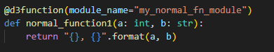
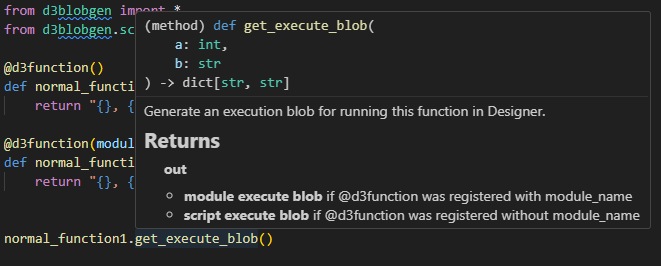

# d3blobgen

Blob generation helper for D3 python plugin.

## Overview

This package provides a decorator-based API for creating D3 Designer plugin functions with automatic blob generation and module registration. Using the `@d3function` decorator, you can transform regular Python functions into D3-compatible functions that generate execution blobs for remote execution in Designer.

### IDE Integration & Type Safety

The `@d3function` decorator preserves full type information and function signatures, providing excellent IDE support:



*Functions decorated with `@d3function` maintain their original signature and type hints*



*IDE shows complete type information including return types and method signatures for the wrapped D3Function*


## Project Structure

```
├── src/
│   ├── main.py                    # Entry point for demonstration
│   └── d3blobgen/                 # Core package
│       ├── __init__.py            # Package exports (d3function, D3Function, etc.)
│       ├── core.py                # Core D3Function wrapper and decorator implementation
│       └── scripts/               # Directory to add any plugin python scripts
│           ├── d3.pyi             # D3 stubs file (replace with latest version)
│           ├── example.py         # Example plugin functions using @d3function
│           └── <YOUR_SCRIPT>.py   # Any plugin python script can be added here
├── tests/
│   ├── __init__.py                # Test package initialization
│   └── test_core.py               # Comprehensive test suite for core functionality
├── pyproject.toml                 # Project configuration with pytest dependencies
├── uv.lock                        # Dependency lock file
└── README.md
```

**Using d3blobgen as a package**

When using d3blobgen in your own projects, ensure the D3 stub file (`d3.pyi`) is located in the same directory as your plugin scripts to access all type information:

```
<YOUR_PROJECT>
├── src/
│   └── main.py                    # Your entry point
│   └── scripts/                   # Directory for your plugin python scripts
│       ├── d3.pyi                 # D3 stubs file (replace with latest version)
│       └── <YOUR_SCRIPT>.py       # Your plugin scripts using @d3function
└── .venv/               
    └── Lib/site-packages/d3blobgen/ # Installed d3blobgen package
```

## Requirements

- **Python**: 3.11 or higher
- [uv](https://docs.astral.sh/uv/getting-started/installation/) for python package

## Installation

```bash
git clone https://github.com/disguise-one/python-plugin-d3blobgen.git
cd python-plugin-d3blobgen
uv sync
```

## Usage

The `@d3function` decorator is the core of d3blobgen. It wraps Python functions and provides automatic blob generation for D3 Designer execution.

### 1. Basic Execute Blob Example

When `d3function` is registered without module name, the execute blob will contain full script along with leading arguments assignment. Also note that the retrieved blob does not have `module_name` field.

```python
from d3blobgen import d3function
from typing import TYPE_CHECKING
if TYPE_CHECKING:
    from d3blobgen.scripts.d3 import * # type: ignore[reportMissingModuleSource]

# Define your plugin function with decorator (no module)
@d3function()
def mrset_fn_with_args(mrset_name:str) -> dict[str, str]:
    mr_set = d3.resourceManager.load(
        'objects/mixedrealityset/{}.apx'.format(mrset_name),
        d3.MixedRealitySet)
    # do anything with mrset
    return { "name": mr_set.name }

# Retrieve execute blob to send to Designer execute endpoint
result = mrset_fn_with_args.get_execute_blob("my_mrset")
print(result["script"])

"""
mrset_name='my_mrset'
mr_set = d3.resourceManager.load('objects/mixedrealityset/{}.apx'.format(mrset_name), d3.MixedRealitySet)
return {'name': mr_set.name}
"""
```

### 2. Module-Based Function Registration

When `d3function` is registered with module name, the execute blob will contain only function call along with module name. 

**Important note:**
- module must be registered first.
- registering module can be done only once.
  - you must define all `d3function`s first, then register the module at the end.

**Register function to module**

```python
from d3blobgen import (
    d3function,
    register_all_d3functions,
    register_module_d3functions
)
from typing import TYPE_CHECKING
if TYPE_CHECKING:
    from d3blobgen.scripts.d3 import * # type: ignore[reportMissingModuleSource]

@d3function(module_name="my_d3_module")
def get_mrset_uid(mrset_name:str) -> dict[str, str]:
    mr_set = d3.resourceManager.load(
        d3.Path('objects/mixedrealityset/{}.apx'.format(mrset_name)),
        d3.MixedRealitySet)
    return { "uid": mr_set.uid }

@d3function(module_name="my_d3_module")
def get_camera_uid(camera_name:str) -> dict[str, str]:
    camera = d3.resourceManager.load(
        d3.Path('objects/camera/{}.apx'.format(camera_name)),
        d3.Camera)
    return { "uid": camera.uid }

register_all_d3functions("localhost") # or register_module_d3functions("localhost", "my_d3_module")
```

**Executing registered function**

```python
# Retrieve execute blob to send to Designer execute endpoint
result1 = get_mrset_uid.get_execute_blob("my_mrset")
result2 = get_camera_uid.get_execute_blob("my_cam")
print(result1)
print(result2)
"""
{'moduleName': 'my_d3_module', 'script': "get_mrset_uid('my_mrset')"}
{'moduleName': 'my_d3_module', 'script': "get_camera_uid('my_cam')"}
"""
```

### 3. Function Inspection

The package provides utilities to inspect registered functions:

```python
from d3blobgen import get_all_d3functions, get_all_modules, D3Function
import json

# List all registered functions
for module_name, function_name in get_all_d3functions():
    print(f"Module: {module_name}, Function: {function_name}")
"""
Module: my_d3_module, Function: get_camera_uid
Module: my_d3_module, Function: get_mrset_uid
"""

# List all registered modules
print("Modules:", get_all_modules())
"""
Modules: ['my_d3_module']
"""

# Blob that gets sent to Designer register endpoint
blob = D3Function.get_module_register_blob("my_d3_module"), indent=2)
print(json.dumps(blob, indent=2))
"""
{
  "moduleName": "my_d3_module",
  "contents": "..."
}
"""
print(blob["contents"])
"""
def get_camera_uid(camera_name: str) -> dict[str, str]:
    camera = d3.resourceManager.load(d3.Path('objects/camera/{}.apx'.format(camera_name)), d3.Camera)
    return {'uid': camera.uid}

def get_mrset_uid(mrset_name: str) -> dict[str, str]:
    mr_set = d3.resourceManager.load(d3.Path('objects/mixedrealityset/{}.apx'.format(mrset_name)), d3.MixedRealitySet)
    return {'uid': mr_set.uid}
"""
```

### 4. Async Support

d3blobgen provides full async support for all remote operations, allowing for non-blocking execution and registration:

**Async function execution:**

```python
import asyncio
from d3blobgen import d3function

@d3function(module_name="my_d3_module")
def get_mrset_uid(mrset_name: str) -> dict[str, str]:
    mr_set = d3.resourceManager.load(
        d3.Path('objects/mixedrealityset/{}.apx'.format(mrset_name)),
        d3.MixedRealitySet)
    return {"uid": mr_set.uid}

async def main():
    # Async execution - non-blocking
    result = await get_mrset_uid.aexecute("my_mrset")
    print(f"MRSet UID: {result['uid']}")

# Run the async function
asyncio.run(main())
```

**Async module registration:**

```python
import asyncio
from d3blobgen import aregister_all_d3functions, aregister_module_d3functions

async def register_modules():
    # Register all modules asynchronously
    results = await aregister_all_d3functions("localhost")
    
    # Or register a specific module
    success, error = await aregister_module_d3functions("localhost", "my_d3_module")
    
    for module_name, (success, error) in results.items():
        if success:
            print(f"Module '{module_name}' registered successfully")
        else:
            print(f"Module '{module_name}' failed: {error}")

asyncio.run(register_modules())
```

**Available async methods:**
- `D3Function.aexecute(*args, **kwargs)` - Async function execution
- `aregister_module_d3functions(ipaddr, module_name)` - Async module registration
- `aregister_all_d3functions(ipaddr)` - Async registration of all modules

### 5. Running the Demo

```bash
uv run python src/main.py
```

## Testing

This project uses pytest with pytest-asyncio for testing both synchronous and asynchronous functionality. To run the tests:

**Install test dependencies**
```bash
uv sync --extra test
```

**Run all tests**
```bash
uv run pytest -v
```

**Run specific test classes**
```bash
# Test async functionality
uv run pytest tests/test_core.py::TestAsyncRegisterAllD3Functions -v

# Test sync functionality  
uv run pytest tests/test_core.py::TestD3Function -v
```

## License

[MIT License](./LICENSE)
